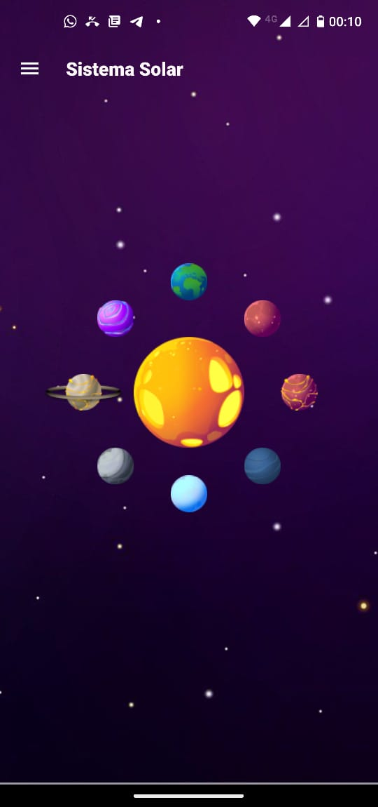
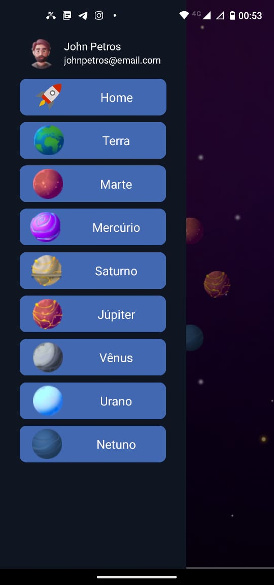
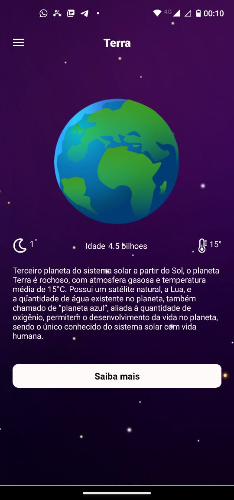
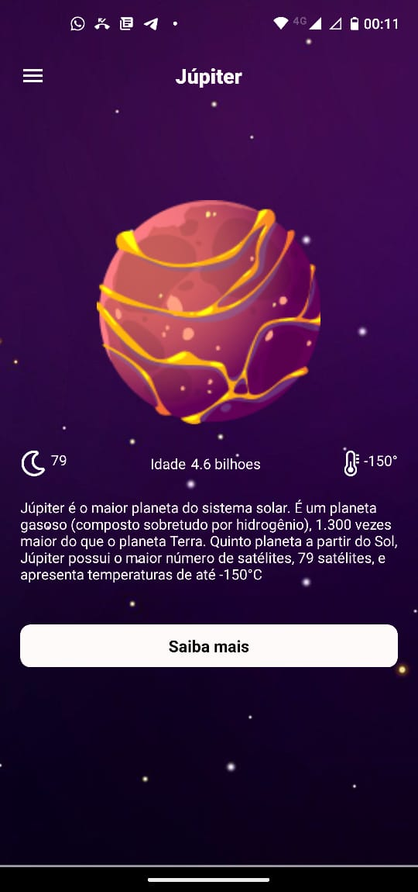
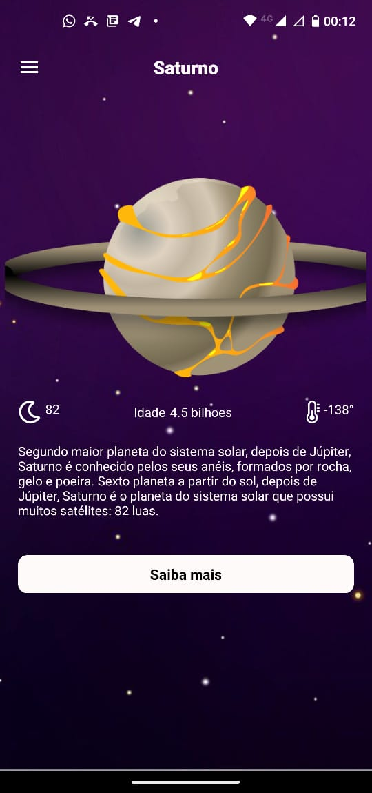
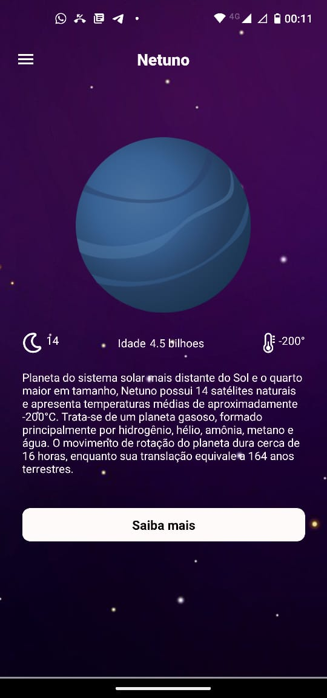

<h1 align="center">
    Solar System App
</h1>

<div align="center">
   <a href="https://github.com/JohnPetros">
      
   </a>
   
   <a href="https://github.com/JohnPetros/solar-system/commits/main">
      
   </a>
  </a>
   </a>
   <a href="https://github.com/JohnPetros/solar-system/blob/main/LICENSE.md">
      
   </a>
    
</div>

<br>

## 🖥️ Projeto

Aplicativo que apresenta dados (nome, idade, quantidade de luas, temperatura ambiente) e informações pertinentes a respeito de cada planeta do nosso sistema solar. Na tela principal, o usuário pode escolher o planeta tanto pela imagem clicável, quanto pelo menu lateral que aparece quando o usuário clica no ícone de menu hambúrguer. Este projeto foi desenvolvido como dever de casa para a disciplina de programação mobile com o intuito de praticar o conceito de menu lateral em React Native.

### Demonstração
<div align="center">
  
  
  
  
  
  
</div>
<hr>


## 📖 Aprendizado

- Context API para compartilhar dados entre vários componentes
- Uso de SGV em React Native
- Construção de menu lateral tanto de forma "nativa", quanto customizada
- Uso de biblioteca de ícones próprias para React Native

<hr>

## 🚀 Tecnologias

Esse projeto foi desenvolvido com as seguintes tecnologias:

- **[React Native](https://expo.io/)**
- **[Expo](https://expo.io/)**
- **[Expo Vector Icons](https://icons.expo.fyi/)**

## Como rodar este projeto

### Pré-requesitos

Antes de baixar o projeto você vai precisar ter instalado na sua máquina as seguintes ferramentas:

- [Git](https://git-scm.com)
- [NodeJS](https://nodejs.org/en/)
- [Yarn](https://yarnpkg.com/) ou [NPM](https://www.npmjs.com/)

Além disto é bom ter um editor para trabalhar com o código como [VSCode](https://code.visualstudio.com/)<br>

> Você poder executar o App no seu celular ou em um emulador de celular da sua preferência usando Expo, ou ainda pela plataforma web do Expo acessando este link: [expo.dev](https://snack.expo.dev/@git/github.com/JohnPetros/solar-system?platform=android).

#### 📟 Rodando o Mobile

```bash
# Clone este repositório
$ git clone  https://github.com/JohnPetros/solar-system.git

# Acesse a pasta do projeto no terminal/cmd
$ cd solar-system

# Instale as dependências
$ npm install

# Execute a aplicação em modo de desenvolvimento
$ npx expo start

```
---

## :memo: Licença

Esse projeto está sob a licença MIT. Veja o arquivo [LICENSE](LICENSE) para mais detalhes.

---

Feito com 💜 by João Pedro 👋🏻
